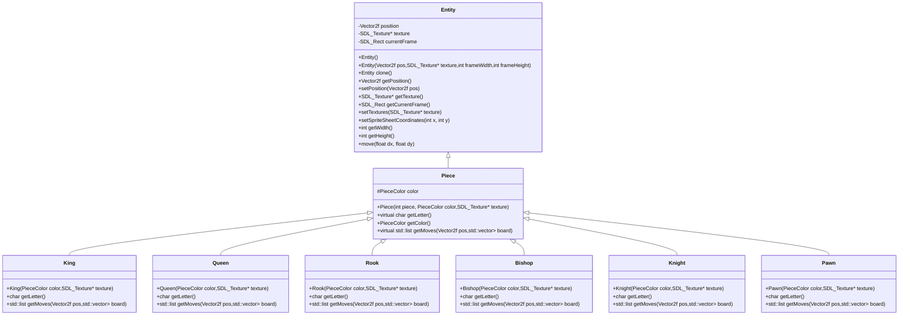

# Chess


## Needed libraries

- SDL2
- SDL2_image
- SDL2_mixer
- SDL2_ttf

## How to compile

### windows

```bash
g++ -O2 src/*.cpp src/pieces/*.cpp -o bin/release/chess -IC:/SDL2/include -Iinclude -LC:/SDL2/lib -w -lmingw32 -lSDL2main -lSDL2 -lSDL2_image -lSDL2_mixer -lSDL2_ttf -mwindows
```


### UML

```mermaid
classDiagram 

    class Game {

        -float currentFrame
        -float accumulator
        -float timeStep
        -RenderWindow window
        -EventManager eventManager
        -UpdateManager updateManager
        -RenderManager renderManager
        -Debug debug
        -std::list<Scene*> scenes

        +Game()
        +~Game()
        +run()
        +Mix_Music* loadMusic(const char *path)
        +Mix_Chunk* loadSound(const char *path)

        -cleanUp()

    }

    class RenderWindow{
        -SDL_Window* window
        -SDL_Renderer* renderer


        +RenderWindow(const char *title, int width, int height)
        +SDL_Texture* loadTexture(const char *path)
        +cleanUp()
        +clear()
        +render(Entity& entity)
        +render(Entity *entity)
        +display()
        +SDL_Renderer* getRenderer()
    }


    class EventManager{

        -SDL_Event event
        -bool gameRunning
        -int scene
        -bool rightClick
        -bool leftClick
        -std::list<SDL_Keycode> keysPressed

        +EventManager()
        +~EventManager()
        +processEvents()
        +bool isRightClick()
        +bool isLeftClick()
        +std::pair<int, int> getMousePosition()
        +bool isGameRunning()
        +changeScene(int scene)
        +int getScene()
        +bool isKeyPressed(SDL_Keycode key)
        +quit()

    }

    class UpdateManager{

        -EventManager& eventManager
        -std::list<Scene*>& scenes

        +UpdateManager(EventManager& eventManager, std::list<Scene*>& scenes)
        +update(int scene)

    }

    class Debug{
        -Font font
        -Entity* TPS
        -Entity* FPS
        -int TPS_int
        -int FPS_int


        +Debug(RenderWindow& window)
        +updateTPS(int tps)
        +updateFPS(int fps)
        +render(RenderWindow& window)
    }

    class Vector2f {
        -float x
        -float y

        +Vector2f()
        +Vector2f(float x, float y)
    }

    class Font {
        -TTF_Font* font
        -SDL_Color color

        +Font(const char* path, int size, SDL_Color color)
        +~Font()
        +TTF_Font* getFont()
        +SDL_Color getColor()
        +Entity* createTextEntity(const char* text, RenderWindow& window, Vector2f pos)
    }

```



